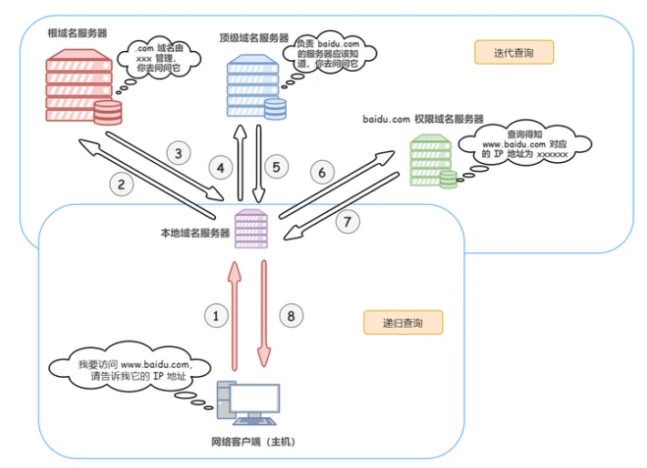

# dns域名解析过程

## 什么是dns
DNS（Domain Names System），域名系统，是互联网一项服务，是进行域名和与之相对应的 IP 地址进行转换的服务器

简单来讲，DNS相当于一个翻译官，负责将域名翻译成ip地址

## 域名结构
域名是一个具有层次的结构，从上到下依次为根域名、顶级域名、二级域名、三级域名..

## 域名服务器
在域名的每一层都会有一个域名服务器，如下图

## 查询方式
- 递归查询
  
本地域名服务器查询自己的dns缓存

- 迭代查询
  
本地域名服务器依次查询根服务器，顶级域名服务器和权限域名服务器

## dns域名解析过程

1. 浏览器dns缓存
2. 操作系统dns缓存
3. 操作系统去查询本地域名服务器
4. 本地域名服务器递归查询自己的缓存
5. 本地域名服务器迭代查询根域名服务器，根域名服务器返回顶级域名服务器地址
6. 本地域名服务器迭代查询顶级域名服务器，顶级域名服务器返回权限域名服务器地址
7. 本地域名服务器迭代查询权限域名服务器，权限域名服务器返回ip地址
8. 本地域名服务器将得到的 IP 地址返回给操作系统，同时自己将 IP 地址缓存
9. 操作系统将 IP 地址返回给浏览器，同时自己也将 IP 地址缓存
10. 至此，浏览器就得到了域名对应的 IP 地址，并将 IP 地址缓存

