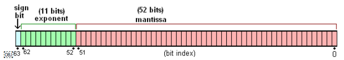

# js数字精度问题

一个经典的题目:
```javascript
0.1 + 0.2 === 0.3 // false
console.log(0.1 + 0.2) // 0.30000000000000004
```
## 原因
js中所有数字都是以64位浮点数形式存储的，即双精度浮点数，IEEE 754标准。
其中1位符号位，11位指数位，52位有效数字位


然而0.1 和 0.2 转化成2进制存储时，会出现无限循环的情况，所以只能截取52位，导致精度丢失，从而出现上述问题。

## 10进制小数转化成2进制
方法: 乘2取整，直到小数部分为0为止
```javascript
// 0.125转化成2进制存储时
0.125 * 2 = 0.25    //  0
0.25 * 2 = 0.5      //  0
0.5 * 2 = 1.0        //  1

// 所以0.125转化成2进制存储时为0.001
//科学计数法是: 1 * 2^(-3)

```
```javascript
// 0.1转化成2进制
0.1 * 2 = 0.2    //  0
0.2 * 2 = 0.4    //  0
0.4 * 2 = 0.8    //  0
0.8 * 2 = 1.6    //  1

0.6 * 2 = 1.2    //  1
0.2 * 2 = 0.4    //  0
0.4 * 2 = 0.8    //  0
0.8 * 2 = 1.6    //  1

0.6 * 2 = 1.2    //  1
0.2 * 2 = 0.4    //  0
0.4 * 2 = 0.8    //  0
0.8 * 2 = 1.6    //  1

//科学计数法 1.（1001） * 2^(-4)
```

```javascript
//0.2转化成二进制
0.2 * 2 = 0.4    //  0
0.4 * 2 = 0.8    //  0
0.8 * 2 = 1.6    //  1

0.6 * 2 = 1.2    //  1
0.2 * 2 = 0.4    //  0
0.4 * 2 = 0.8    //  0
0.8 * 2 = 1.6    //  1

0.6 * 2 = 1.2    //  1
0.2 * 2 = 0.4    //  0
0.4 * 2 = 0.8    //  0
0.8 * 2 = 1.6    //  1

//科学计数法 1.（1001） * 2^(-4)
```

## 解决方案
### 方案1
1. 用toFixed取指定位数转化成字符串
2. 用parseFloat转化成浮点数
```javascript
(0.1 + 0.2).toFixed(5)  // “0.30000”

parseFloat((0.1 + 0.2).toFixed(5)) // 0.3
```

### 方案2
使用第三方库，如Math.js、BigDecimal.js
```javascript
const math = require('mathjs');

// 使用 BigNumber 处理 0.1 和 0.2
const a = math.bignumber(0.1);
const b = math.bignumber(0.2);

// 进行加法运算
const result = math.add(a, b);

//结果类型需要转成number
console.log(typeof result);  //object
console.log(math.number(result) === 0.3); //true

```