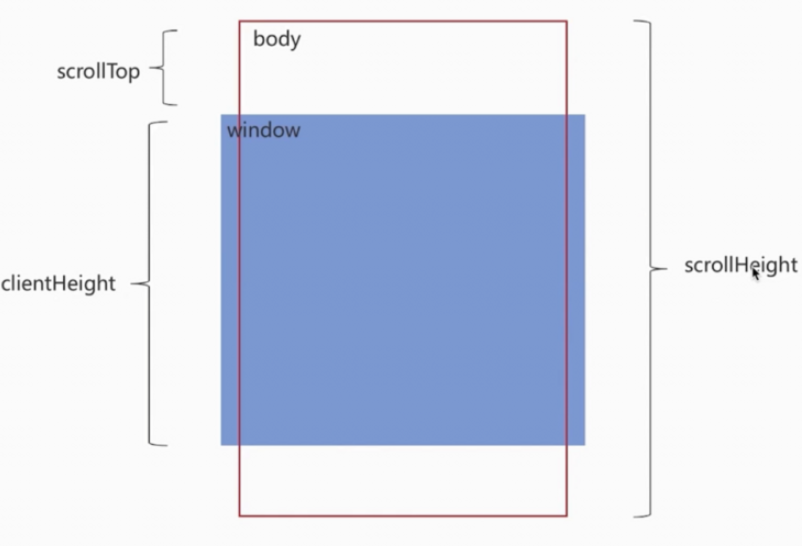

# 上拉加载
## 原理
1. 监听滚动条事件
2. 判断滚动条是否到底部
3. 到底部则加载更多数据
4. 加载完成后，更新滚动条位置



上拉加载的本质是页面触底，或者快要触底时的动作
判断页面触底我们需要先了解一下下面几个属性

- scrollTop：滚动视窗的高度距离window顶部的距离，它会随着往上滚动而不断增加，初始值是0，它是一个变化的值
- clientHeight:它是一个定值，表示屏幕可视区域的高度；
- scrollHeight：页面不能滚动时也是存在的,此时scrollHeight等于clientHeight。scrollHeight表示body所有元素的总长度(包括body元素自身的padding)
```javascript
//触底公式
scrollTop + clientHeight >= scrollHeight - 缓冲距离
```

## 实现
### html
```html
<div class="container"></div>
<div class="loading">加载中...</div>
```

### js
```javascript
   //获取dom
      const container = document.querySelector(".container");
      const loading = document.querySelector(".loading");

      //模拟加载数据
      let itemCount = 0;
      function loadData() {
        for (let i = 0; i < 10; i++) {
          const item = document.createElement("div");
          item.innerText = `数据项 ${itemCount + 1}`;
          item.classList.add("item");
          container.appendChild(item);
          itemCount++;
        }
      }
      //监听是否在加载
      let isLoading = false;

      //监听滚动事件
      window.addEventListener("scroll", () => {
        //当前浏览器高度
        let clientHeight = document.documentElement.clientHeight;
        //滚动距离
        let scrollTop = document.documentElement.scrollTop;
        //页面总高度
        let scrollHeight = document.documentElement.scrollHeight;

        //判断是否快滚动到底部
        // 留50px的缓冲距离
        if (clientHeight + scrollTop >= scrollHeight - 50) {
          if (!isLoading) {
            loadMoreData();
          }
        }
      });

      function loadMoreData() {
        loading.classList.add("active");
        loading.style.display = "block";
        isLoading = true;
        setTimeout(() => {
          loadData();
          isLoading = false;
          loading.classList.remove("active");
          loading.style.display = "none";
        }, 1500);
      }

      //初次加载
      loadData();
```

### css
```css
 * {
        box-sizing: border-box;
        margin: 0;
        padding: 0;
      }

      body {
        font-family: Arial, sans-serif;
      }

      .container {
        max-width: 600px;
        margin: 0 auto;
        padding: 20px;
        overflow-y: auto;
      }

      .item {
        padding: 15px;
        margin: 10px 0;
        background-color: #f4f4f4;
        border: 1px solid #ddd;
      }

      .loading {
        text-align: center;
        padding: 15px;
        font-size: 14px;
        display: none;
      }
```