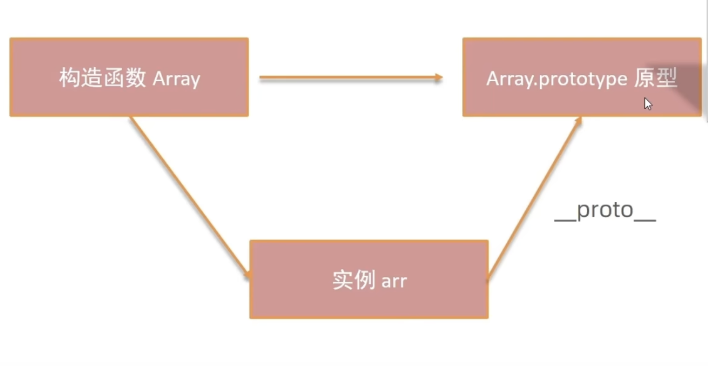

# 原型和原型链
## 原型对象
在JavaScript中，每个对象都有一个与之关联的**原型对象**，这个原型对象是一个普通的对象，它定义了对象的一些属性和方法。通过原型对象，JavaScript中的对象可以共享一些属性和方法，从而节省内存空间。

```javascript
let arr = Array(1, 2, 3)
arr.sort()
```


上面的arr为什么能使用数组的方法, 因为arr的原型对象是Array.prototype，Array.prototype中定义了sort方法，所以arr可以调用sort方法。

构造函数Array通过prototype可以找到原型对象，里面定义了一些方法。
实例arr通过__proto__属性也可以找到这个原型对象，从而使用里面的方法。

## 原型链
原型链是由多个对象通过其原型属性连接而成的链式结构。当试图访问一个对象的属性时，JavaScript会首先检查该对象自身是否有该属性，如果没有，则会沿着原型链向上查找。
```javascript
function Person(name) {
    this.name = name;
    this.age = 18;
    this.sayName = function() {
        console.log(this.name);
    }
}
// 第二步 创建实例
var person = new Person('person')
```

* 构造函数Person存在原型对象Person.prototype

* 构造函数生成实例person，person的__proto__指向构造函数Person原型对象

* Person.prototype.__proto__ 指向内置对象，因为 Person.prototype 是个对象，默认是由 Object函数作为类创建的，而 Object.prototype 为内置对象

* Object.prototype.__proto__ 为 null，说明原型链到顶了

